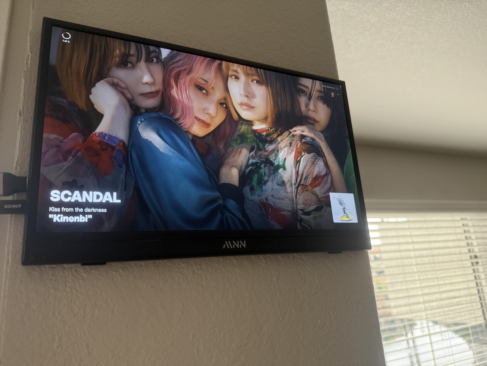
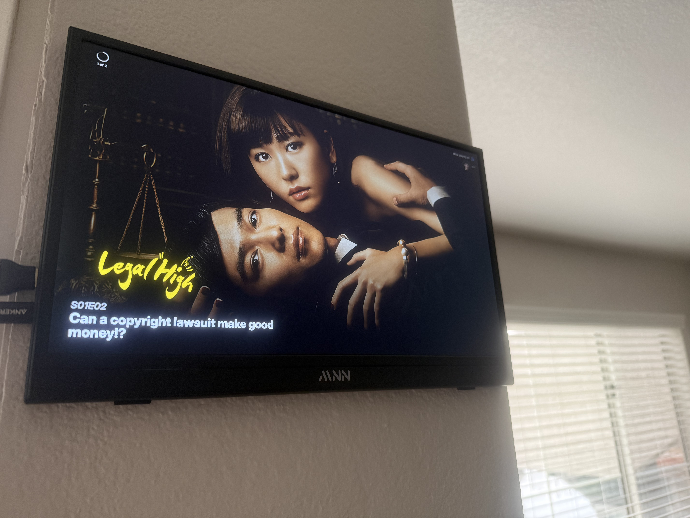
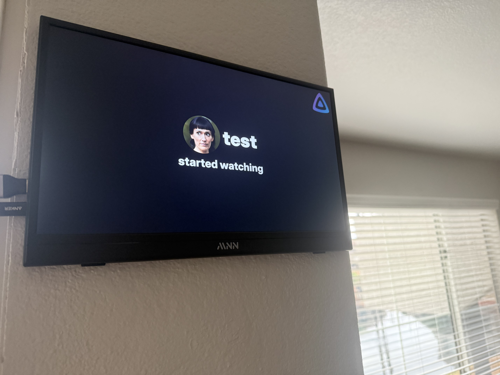
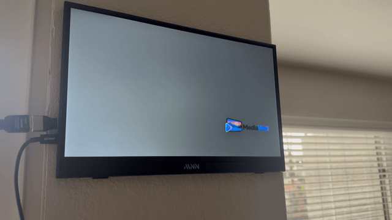
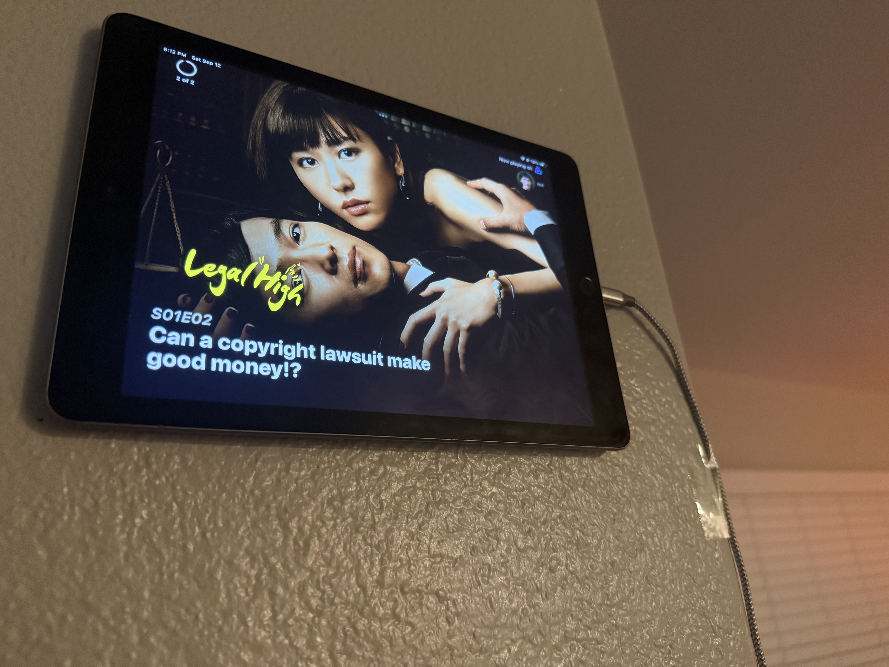

<p align="center">
  <a href="https://ko-fi.com/yeahnoforsure_" target="_blank" rel="noopener noreferrer">
    
  </a>
</p>

<p align="center">
  Also by me:
  <a href="https://github.com/nothing2obvi/pixelfin">Pixelfin</a> ·
  <a href="https://github.com/nothing2obvi/jellyfin-plugins/tree/main/Jellytag">JellyTag-Plus</a> ·
  <a href="https://github.com/nothing2obvi/jellyfin-plugins/tree/main/TaskGrid">TaskGrid</a>
</p>

# MediaWall

## TL;DR

MediaWall is a way to take advantage of an old iPad, a Raspberry Pi with a display, or any spare screen by turning it into a live window into your Jellyfin and Navidrome servers. It can show what you and your users are currently watching or listening to, cycle through artwork from your libraries as a screensaver, or display favorite media as wallpapers. It also supports custom sounds, layouts, and fallback screens. Basically, it's a fun little project that's an overengineered way to view active sessions and make your media library visible instead of leaving all that artwork buried in storage.

## Screenshots







<p align="center">
  
</p>





## ⚠️ Disclaimers

MediaWall is under active development. There may be breaking changes, which will be highlighted in every release.

Like [Pixelfin](https://github.com/nothing2obvi/pixelfin), this project is vibecoded with Codex. It's built with security in mind, but because it's a vibecoded self-hosted app, I can't promise it's hardened for hostile public exposure. Prioritize running it locally or behind access controls you trust.

## Intro

In line with my ongoing obsession with the images and artwork in Jellyfin, as seen through my other project, [Pixelfin](https://github.com/nothing2obvi/pixelfin), I wanted to combine my appreciation for the Jellyfin Android TV screensaver with the fact that I also like being able to glance over and see what people are currently watching or listening to on my Jellyfin and Navidrome servers.

Then I realized I had an old iPad laying around doing absolutely nothing. I wanted something that would work on that, or on something like a Raspberry Pi connected to a display. MediaWall was born.

MediaWall is a display app for Jellyfin and Navidrome built around three main features, and it's meant to work well on an old iPad, a Raspberry Pi connected to a monitor, or really any device with a browser. Each display space also has a phone-friendly remote at the same route with `-remote` appended, so you can control the display without walking over to it.

The first, and most prominent, is **Now Playing**. MediaWall shows what's currently being watched or listened to across your Jellyfin and Navidrome servers, along with artwork, user information, media details, and optional sound notifications when sessions start or end. When nothing is playing, you can show shuffled artwork, use the standard MediaWall fallback with the bundled logo, or use your own custom server logo.

The sound system is customizable too. You can use one global sound, assign custom sounds to individual users, and control when sounds should or shouldn't play. This is especially useful with Navidrome or Jellyfin music libraries, where you probably don't want a notification every time the next song starts.

MediaWall can also react to configured Jellyfin collections by using collection-specific sounds and transition images when matching media starts playing.

The second feature is **Screensaver mode**. This is heavily inspired by the Jellyfin Android TV screensaver and cycles through artwork from your Jellyfin libraries, with additional options for controlling what appears and how it's displayed. The idea is to turn an otherwise unused screen into a constantly changing showcase for the artwork already sitting in your media collection. I know many of you have terabytes of media, but most of the time it's all just data sitting there. MediaWall gives you a way to passively browse your libraries and actually see more of it.

Third is **Wallpaper mode**. If MediaWall lands on something you particularly like, you can pause on that media item and use it as a static wallpaper. You can also choose favorites and have MediaWall cycle through those instead, essentially creating your own curated rotation of artwork.

So depending on how you use it, MediaWall can be a live window into your Jellyfin and Navidrome servers, a Jellyfin-powered digital art display, or basically a very overengineered way to give an old iPad, Raspberry Pi, or spare screen something useful to do.

Is this necessary? No!

Is it a kind of fun excuse to use more electricity and tinker with something? Yes :)

## Use Cases

### See What Everyone Is Watching or Listening To

Put MediaWall on an iPad, tablet, TV, or Raspberry Pi display in a shared room and use it as a live window into your media server.

If someone is watching something on Jellyfin or listening to music through Navidrome, MediaWall can automatically show active sessions with backdrop artwork, logos, playback information, source icons, and, if you want, the name or avatar of the person using it.

So instead of asking, "What are we listening to?" or checking Jellyfin manually, you can just glance at the display.

### Turn It Into a Homelab Playback Dashboard

If you run Jellyfin for multiple people, MediaWall can also act as a simple visual dashboard for your server. Set it to watch all Jellyfin users, and the display will automatically show all active sessions.

It's an easy way to make activity on your server feel a little more visible and alive without opening an admin dashboard or staring at a list of sessions.

### Use It as an Artwork Display

MediaWall doesn't have to show playback activity at all.

You can put it on a desk, shelf, wall-mounted tablet, or Raspberry Pi-connected display and use it as a rotating screensaver for the artwork in your Jellyfin library. I know that many of you have terabytes of media, but it's all just data. MediaWall allows its viewers to passively browse your libraries.

If you don't want it pulling from everything, open the grid and favorite the artwork you actually want to see, or only allow specific libraries. MediaWall can then rotate through only those favorites or libraries, essentially turning your media collection into a curated digital art display.

And if one image looks especially good, just pause the slideshow and leave it there as a clean static wallpaper.

That's really the idea behind MediaWall: it can be a Now Playing display, a homelab dashboard, a screensaver, a wallpaper, or some combination of all of them depending on where you put it.

## What It Does

- Shows active playback sessions from Jellyfin, Navidrome, or both.
- Supports multiple MediaWall users per space, including Jellyfin `All` users.
- Can show a configurable user-intro transition when a Now Playing session first appears.
- Falls back to a default MediaWall screen, shuffled artwork, or an optional per-space Immich Kiosk display when nothing is playing.
- Provides a full-screen Wallpaper/Screensaver mode with library browsing, favorites, shuffle, logos, media info, transitions, and subtle backdrop motion.
- Uses Jellyfin backdrops/logos where available.
- Can use Navidrome playback for music-focused setups, and Navidrome can use Jellyfin's images when both services are configured.
- Can use local artist backdrop and logo files for Navidrome-only artwork.
- Caches grid/backdrop images with startup and cron-based library scans.

Jellyfin is recommended because MediaWall can use its rich backdrop, logo, user avatar, movie, series, and artist metadata. Navidrome isn't strictly required, and Jellyfin isn't strictly required for a music-only wall: Navidrome can drive Now Playing and local artist backdrop files can provide artwork. If both Jellyfin and Navidrome are configured, Navidrome playback can match against Jellyfin artist data so the Now Playing and Wallpaper/Screensaver views still benefit from Jellyfin's images.

## Quick Start

Create a `docker-compose.yml`:

```yaml
services:
  mediawall:
    image: ghcr.io/nothing2obvi/mediawall:latest
    container_name: mediawall
    restart: unless-stopped
    ports:
      - "1221:1221"
    env_file:
      - .env
    volumes:
      - ./config.yml:/app/config.yml:ro
      - ./data:/app/data
      - ./app/sounds:/app/sounds:ro
      - ./app/custom_logo:/app/custom_logo:ro
      - ./app/collections:/app/collections:ro
      # Only needed when using Navidrome with local artist backdrop/logo files.
      # - /path/to/your/navidrome/music:/navidrome_music:ro
```

Then:

1. Copy `.env.example` to `.env`.
2. Fill in Jellyfin and/or Navidrome connection values.
3. Edit `config.yml` for your spaces and libraries.
4. Start the app:

```sh
docker compose up -d
```

Open a space:

```text
http://localhost:1221/livingroom
http://localhost:1221/office
http://localhost:1221/homelab
```

If a space has a password, pass it in the URL:

```text
http://localhost:1221/livingroom?password=your-password
```

You can also open a mobile-friendly remote for any space by adding `-remote` to the space name:

```text
http://localhost:1221/livingroom-remote
```

The remote follows the same password rule as the space, so a protected remote uses the same `?password=` value.

Interactive state is stored in `data/state.json`. Image cache data is stored under the configured library scan directory, which defaults to `/app/data/grid-cache` inside the container.

## Controls

### Keyboard Shortcuts

These work in both Now Playing and Wallpaper/Screensaver mode unless noted.

| Key | Action |
| --- | --- |
| `f` | Enter or exit fullscreen. |
| `Escape` | Exit fullscreen. |
| `ArrowLeft` | Previous session or previous artwork. |
| `ArrowRight` | Next session or next artwork. |
| `Space` | Pause or resume the current mode. |
| `m` | Cycle through Now Playing, Wallpaper/Screensaver, and Immich Kiosk when that space has a Kiosk URL. |
| `t` | Cycle themes when the space uses `theme: All` or has no explicit theme. |
| `y` | Toggle local sound mute when sounds are enabled for the space. |
| `l` | Toggle logo display. |
| `i` | Toggle the media-info option for the current media type. |
| `a` | Toggle album art when available. |
| `s` | Toggle shuffle in Wallpaper/Screensaver mode. |
| `g` | Toggle the grid in Wallpaper/Screensaver mode. |
| `c` | Toggle the selection dialog in Wallpaper/Screensaver mode. |
| `ArrowUp` / `ArrowDown` | Switch libraries in Wallpaper/Screensaver mode when shuffle is off. |

### Tapping and Clicking

These work in both Now Playing and Wallpaper/Screensaver mode.

| Gesture | Action |
| --- | --- |
| Tap or click left side | Previous session or previous artwork. |
| Tap or click right side | Next session or next artwork. |
| Tap or click center | Show the controls. |
| Triple-tap or triple-click center | Enter fullscreen, or exit fullscreen if already fullscreen. |
| Five quick center taps or clicks | Toggle local sound mute when sounds are enabled for the space. |

## Display Setup

### Apple Devices

Open your MediaWall space in Safari, tap the Share button, then choose **Add to Home Screen**. Launching from the Home Screen runs it like a PWA. If sounds are enabled, tap the MediaWall screen once after opening so Safari allows audio playback.

On a regular computer, you can also open the space in a browser and make MediaWall fullscreen with the shortcuts listed below.

If animation changes seem to stick in the Home Screen app even though Safari shows the new behavior, delete the Home Screen app, go to **Settings -> Safari -> Clear History and Website Data**, open the MediaWall URL in Safari, refresh it, then add it to the Home Screen again.

Different devices handle motion differently. On older devices such as a 2017 iPad, start with simpler transitions like `crossfade` or `fade`, and gentler animations like `breathe`, `pan`, or `focus`. `kenburns`, `drift`, and the directional slide/push transitions can look great on faster displays, but they may feel heavier on older tablets.

### Android Devices

Open your MediaWall space in Chrome, open the browser menu, then choose **Add to Home screen** or **Install app** if Chrome offers it. If sounds are enabled, tap the screen once after opening so the browser allows audio playback.

On devices with a keyboard or touch display, use the shortcuts in the Controls section above.

### Raspberry Pi

One common setup is to launch Chromium in kiosk mode after the desktop starts:

```sh
chromium-browser --kiosk --app=http://localhost:1221/livingroom
```

Use the URL for the space you want to display. If the MediaWall container is running on another machine, replace `localhost` with that machine's IP address.

If you're not using kiosk mode, open the space in a regular browser and press `f` for fullscreen.

## Docker Commands

Once the container is running, you can test sounds, MediaWall fallback animations, and backdrop animations from inside the container:

```sh
docker exec mediawall npm run mediawall -- play sound noted.mp3 on livingroom
docker exec mediawall npm run mediawall -- play sounds All on livingroom
docker exec mediawall npm run mediawall -- play mediawall dvd on livingroom
docker exec mediawall npm run mediawall -- play screensaver All on livingroom
docker exec mediawall npm run mediawall -- play user transition on livingroom
docker exec mediawall npm run mediawall -- play user transition Jon on livingroom
docker exec mediawall npm run mediawall -- animation pan on livingroom
docker exec mediawall npm run mediawall -- animation all --random on livingroom
```

The MediaWall fallback test displays the selected fallback for 30 seconds. `All` previews each configured MediaWall fallback animation for 30 seconds each and labels the current one in the bottom-right corner. Animation previews use the current backdrop by default; add `--random` to pick a random backdrop for the preview. `play sounds All` plays each available sound with two seconds between sounds and labels the current sound in the bottom-right corner. `play user transition` previews the Now Playing user-intro overlay. The command reads `config.yml`, so it can target password-protected spaces without putting the password in the command.

## Remote

Every display space has a matching remote URL. For example, `/livingroom` has `/livingroom-remote`. The remote is meant for a phone or small tablet, works vertically or horizontally, and exposes the main controls: previous/next, pause/play in Wallpaper/Screensaver mode, mode, selection, grid, shuffle, favorites, media info, fullscreen, and sound mute when sounds are enabled.

The remote controls the same server-owned presentation state as the display. Browsers connected to the same space share the current mode, item/session, backdrop position, pause state, and transition deadline; another space keeps its own independent timeline. MediaWall uses a lightweight server-sent events connection to wake clients when that shared state changes, plus shared server timestamps so it doesn't need to send timer ticks every second.

Dialogs and the grid can be dismissed by tapping outside them or tapping the same remote button again. The grid uses the same libraries, favorite filtering, and password rules as the display. Remote button presses also show the same brief center-screen feedback icons on the display.

Display and remote routes install as distinct PWAs. A route ending in `-remote` uses the remote icon and its own manifest identity; normal space routes use the MediaWall logo. Query-string passwords are preserved in the launch URL but aren't used when deciding which icon/identity applies.

## Immich Kiosk Fallback

MediaWall v0.3 adds [Immich Kiosk](https://github.com/damongolding/immich-kiosk) as an optional Now Playing fallback. It isn't the default and is configured independently for each space. When a configured space has no active sessions, MediaWall embeds the existing Immich Kiosk application across the full display and hides its own on-screen controls. Immich Kiosk keeps its own slideshow, menus, touch handling, and other interactions; MediaWall doesn't recreate them.

```yaml
spaces:
  homelab:
    now_playing:
      fallback: immich_kiosk
      immich_kiosk:
        url: "${HOMELAB_IMMICH_KIOSK_URL}"
```

Put the actual URL in `.env`, especially when it contains an Immich Kiosk password:

```env
HOMELAB_IMMICH_KIOSK_URL=https://immich-kiosk.example.com/?password=replace-me
```

MediaWall remains loaded behind the handoff and continues checking Jellyfin and Navidrome. When playback becomes active, it smoothly fades the embedded Kiosk out and resumes the normal Now Playing session flow. After the final session ends and MediaWall's normal missing-session grace period expires, the Kiosk fades back in. The iframe stays mounted while Now Playing is visible, so a Kiosk album or link selected by the viewer remains selected when the fallback returns. Other spaces keep their own configured fallback.

When a Kiosk URL is configured, Immich Kiosk also appears as a third top-level mode alongside Now Playing and Wallpaper/Screensaver. In that mode, only MediaWall's mode control appears at the bottom of the screen; Immich Kiosk keeps its own controls and interactions at the top. The third mode is omitted entirely for spaces without a Kiosk URL.

The Kiosk URL must be reachable from both the MediaWall container and the display browser, and the Kiosk server must allow iframe embedding. MediaWall checks reachability and common frame-blocking headers before displaying it. A missing, invalid, unreachable, timed-out, or explicitly frame-blocked Kiosk falls back to the ordinary MediaWall idle screen instead of leaving the display blank. Some upstream proxies add `X-Frame-Options` or Content Security Policy headers even when Immich Kiosk itself doesn't; adjust that proxy if embedding is blocked.

Fullscreen remains owned by the outer MediaWall page, while the iframe is granted fullscreen permission for Kiosk features that request it. In a PWA, iframe navigation stays inside the MediaWall app and doesn't replace the outer space URL or its browser history. Browser security prevents MediaWall from inspecting a cross-origin Kiosk's internal UI, so an unusual frame failure introduced after the initial load may require correcting the Kiosk or reverse-proxy configuration. MediaWall controls intentionally remain unavailable while the Kiosk handoff is active; use the matching MediaWall remote route if you need to control the space during that time.

## Themes

MediaWall v0.3 includes the existing `default` appearance plus 20 selectable themes: Dracula, Nord, Catppuccin Latte, Catppuccin Mocha, Gruvbox Dark, Gruvbox Light, Solarized Dark, Solarized Light, Tokyo Night, One Dark, Monokai, Rose Pine, Everforest, Kanagawa, Synthwave 84, Material Palenight, Night Owl, Ayu Mirage, GitHub Light, and Tomorrow Night.

Set `theme: All` on a space, or omit `theme`, to let viewers change it using the Themes button or the `t` key. The Themes button sits immediately before the version number and stays open while choices are applied, so colors can be compared quickly. The selected theme is stored in the synchronized space state: displays, remotes, reconnects, and refreshes all use the same choice. The remote includes the same selector and an explicit Cancel button. Selecting the current theme again does nothing and doesn't create another toast.

Set a specific theme name to lock that space to it. Fixed-theme spaces hide the Themes button, ignore `t`, and reject interactive theme changes from remotes or browsers. Themes change text, secondary text, accent colors, borders, controls, dialogs, toasts, and avatar outlines. They don't alter media artwork. Existing translucent surfaces, text shadows, and contrast treatments remain in place so both light and dark themes stay legible over changing backdrops.

## Deployment Notes

Current compose examples mount `./app/sounds`, `./app/custom_logo`, and `./app/collections` separately. Add custom sounds to `app/sounds` so MediaWall has one canonical sound directory at `/app/sounds`. Mounting the whole `/app` directory is not recommended because it can hide the application files inside the container.

## Configuration

Secrets should live in `.env`. Display behavior should live in `config.yml`.

For the complete configuration reference, including every section, option, default, required value, and notes, see [CONFIGURATION.md](CONFIGURATION.md). Optional settings can be omitted from `config.yml`; MediaWall uses the documented defaults.

### Environment Variables

```env
JELLYFIN_URL=http://jellyfin.example.local:8096
JELLYFIN_API_KEY=replace-with-a-jellyfin-admin-api-key
JELLYFIN_USER=mediawall

NAVIDROME_URL=http://navidrome.example.local:4533
NAVIDROME_USER=mediawall
NAVIDROME_PASSWORD=replace-with-a-navidrome-password

LIVINGROOM_PASSWORD=
HOMELAB_PASSWORD=

LOG_LEVEL=info
```

The Jellyfin API key should belong to a Jellyfin admin user. MediaWall uses it to read sessions, users, libraries, and artwork. Individual Jellyfin display users can still be selected per MediaWall user in `config.yml`, including `All`.

For Navidrome, configure each Navidrome account you want MediaWall to distinguish as its own MediaWall user. Navidrome users are what let MediaWall show unique sessions and user names when more than one person is listening. For example, you can add `NAVIDROME_JON_USER`, `NAVIDROME_JON_PASSWORD`, `NAVIDROME_GUEST_USER`, and `NAVIDROME_GUEST_PASSWORD`, then reference those from separate `users` entries in `config.yml`.

Password environment variables are per space by convention. In addition to `LIVINGROOM_PASSWORD=` and `HOMELAB_PASSWORD=`, you can create any others you need, such as `OFFICE_PASSWORD=` or `KITCHEN_PASSWORD=`, then reference them from the matching space.

Use `LOG_LEVEL=debug` when troubleshooting playback, session cycling, scans, or artwork behavior. Supported values are `debug`, `info`, `warn`, `error`, and `silent`; the default is `info`.

## Jellyfin And Navidrome Notes

Jellyfin gives the best experience because MediaWall can access:

- Now Playing sessions
- user avatars
- movie, series, episode, and music metadata
- backdrops
- logos
- image tags for cache-busting changed artwork

Navidrome can be used for music playback. For artwork, MediaWall can use matching Jellyfin artist data when both services are configured, or local artist backdrop files when running Navidrome-only.

For Navidrome-only installations, enable:

```yaml
navidrome:
  artwork:
    local_files: true
```

Then add at least one `path_mappings` mapping whose `mediawall` value points to the local root containing artist folders:

```yaml
navidrome:
  artwork:
    path_mappings:
      - navidrome: "/music"
        mediawall: "/navidrome_music"
```

Older configs using `jellyfin` in a path mapping are still accepted for compatibility, but new configs should use `mediawall`.

## Development

Install dependencies:

```sh
npm install
```

Run checks:

```sh
npm run typecheck
npm run build
```

Run locally:

```sh
npm run dev
```

## License

Starting with v0.2, MediaWall is licensed under the [GNU Affero General Public License v3.0](LICENSE). MediaWall remains open source and may still be used commercially, but modified versions used over a network must make the corresponding source code available under the terms of the AGPLv3. Previously released MIT versions remain under the license that accompanied those releases.

## Contributors

Contributions welcome.
