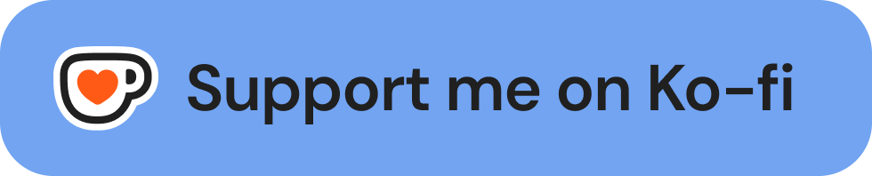
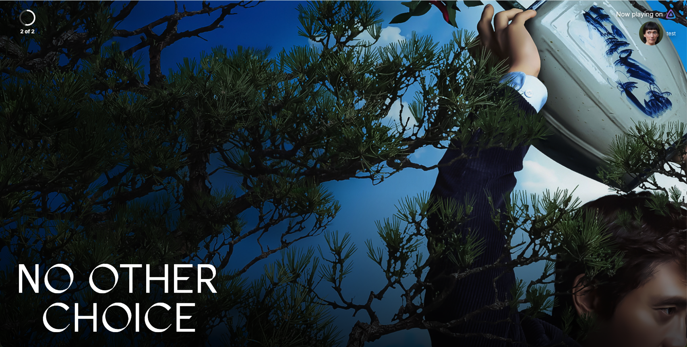
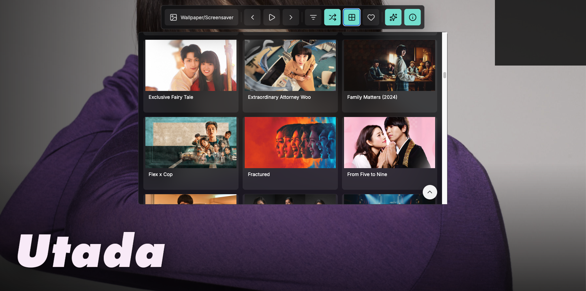
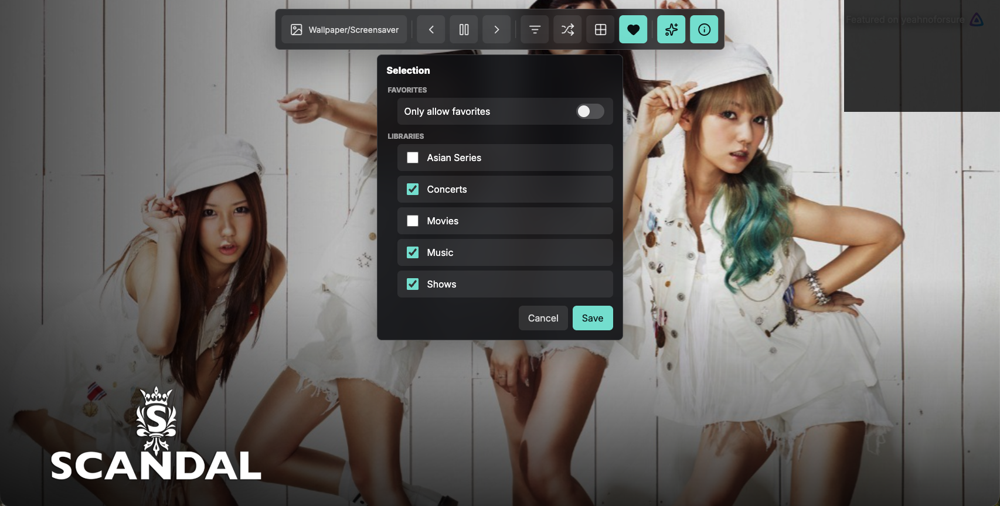
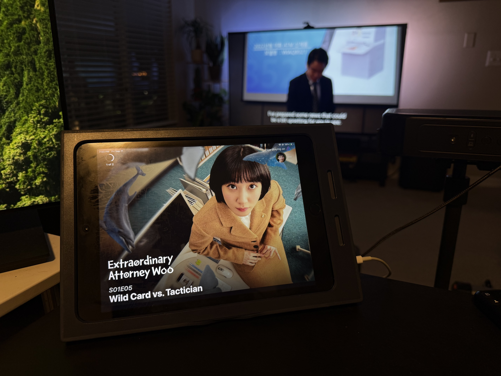

<p align="center">
  <a href="https://ko-fi.com/yeahnoforsure_" target="_blank" rel="noopener noreferrer">
    
  </a>
</p>

<p align="center">
  Also by me: <a href="https://github.com/nothing2obvi/pixelfin">Pixelfin</a>
</p>

# MediaWall

## ⚠️ Disclaimers

MediaWall is under active development. There may be breaking changes, which will be highlighted in every release.

Like [Pixelfin](https://github.com/nothing2obvi/pixelfin), this project is vibecoded with Codex. It's built with security in mind, but because it's a vibecoded self-hosted app, I can't promise it's hardened for hostile public exposure. Prioritize running it locally or behind access controls you trust.

## Intro

In line with my ongoing obsession with the images and artwork in Jellyfin, as seen through my other project, [Pixelfin](https://github.com/nothing2obvi/pixelfin), I wanted to combine my appreciation for the Jellyfin Android TV screensaver with the fact that I also like being able to glance over and see what people are currently watching or listening to on my Jellyfin and Navidrome servers.

Then I realized I had an old iPad laying around doing absolutely nothing. I wanted something that would work on that or something like a Raspberry Pi. MediaWall was born.

MediaWall is a display app for Jellyfin and Navidrome built around three main features, and it's meant to work well on things like an old iPad, a Raspberry Pi connected to a monitor, or really any device with a browser.

The first, and most prominent, is Now Playing. MediaWall shows what's currently being watched or listened to across your Jellyfin and Navidrome servers, along with artwork, user information, media details, and optional sound notifications when sessions start or end. When nothing's playing in Now Playing mode, you can choose to show shuffled artwork, use the MediaWall fallback with the bundled logo, or use the fallback mode with your own custom logo made for your server.

The sound system is customizable too. You can use one global sound, assign custom sounds to individual users, and control when sounds should or shouldn't play. This is especially useful with Navidrome or Jellyfin music libraries, where you probably don't want a notification every time the next song starts.

The second feature is Screensaver mode. This is heavily inspired by the Jellyfin Android TV screensaver and cycles through artwork from your Jellyfin libraries, with some additional options for controlling what appears and how it's displayed. The idea is to turn an otherwise unused screen, whether that's an old iPad or a Raspberry Pi display, into a constantly changing showcase for the artwork already sitting in your media collection. I know that many of you have terabytes of media, but it's all just data. MediaWall allows its viewers to passively browse your libraries.

Third is Wallpaper mode. If MediaWall lands on something you particularly like, you can pause on that media item and use it as a static wallpaper. You can also choose favorites and have MediaWall cycle through those instead, essentially creating your own curated rotation of artwork.

So depending on how you use it, MediaWall can be a live window into your Jellyfin and Navidrome servers, a Jellyfin-powered digital art display, or basically a very overengineered way to give an old iPad, Raspberry Pi, or spare screen something useful to do.

Is this necessary? No!

Is it a kind of fun excuse to use more electricity and tinker with something? Yes :)

--

## Use Cases

### See What Everyone Is Watching Or Listening To

Put MediaWall on an iPad, tablet, TV, or Raspberry Pi display in a shared room and use it as a live window into your media server.

If someone is watching something on Jellyfin or listening to music through Navidrome, MediaWall can automatically show active sessions with backdrop artwork, logos, playback information, source icons, and, if you want, the name or avatar of the person using it.

So instead of asking, "What are we listening to?" or checking Jellyfin manually, you can just glance at the display.

### Turn It Into A Homelab Playback Dashboard

If you run Jellyfin for multiple people, MediaWall can also act as a simple visual dashboard for your server. Set it to watch all Jellyfin users, and the display will automatically show all active sessions.

It's an easy way to make activity on your server feel a little more visible and alive without opening an admin dashboard or staring at a list of sessions.

### Use It As An Artwork Display

MediaWall doesn't have to show playback activity at all.

You can put it on a desk, shelf, wall-mounted tablet, or Raspberry Pi-connected display and use it as a rotating screensaver for the artwork in your Jellyfin library. I know that many of you have terabytes of media, but it's all just data. MediaWall allows its viewers to passively browse your libraries.

If you don't want it pulling from everything, open the grid and favorite the artwork you actually want to see, or only allow specific libraries. MediaWall can then rotate through only those favorites or libraries, essentially turning your media collection into a curated digital art display.

And if one image looks especially good, just pause the slideshow and leave it there as a clean static wallpaper.

That's really the idea behind MediaWall: it can be a Now Playing display, a homelab dashboard, a screensaver, a wallpaper, or some combination of all of them depending on where you put it.

## Screenshots










## What It Does

- Shows active playback sessions from Jellyfin, Navidrome, or both.
- Supports multiple MediaWall users per space, including Jellyfin `All` users.
- Falls back to a default MediaWall screen or shuffled artwork when nothing is playing.
- Provides a full-screen Wallpaper/Screensaver mode with library browsing, favorites, shuffle, logos, media info, transitions, and subtle backdrop motion.
- Uses Jellyfin backdrops/logos where available.
- Can use Navidrome playback for music-focused setups, and Navidrome can use Jellyfin's images when both services are configured.
- Can use local artist backdrop and logo files for Navidrome-only artwork.
- Caches grid/backdrop images with startup and cron-based library scans.

Jellyfin is recommended because MediaWall can use its rich backdrop, logo, user avatar, movie, series, and artist metadata. Navidrome isn't strictly required, and Jellyfin isn't strictly required for a music-only wall: Navidrome can drive Now Playing and local artist backdrop files can provide artwork. If both Jellyfin and Navidrome are configured, Navidrome playback can match against Jellyfin artist data so the Now Playing and Wallpaper/Screensaver views still benefit from Jellyfin's images.

## Quick Start

Create a `docker-compose.yml`:

```yaml
services:
  mediawall:
    image: ghcr.io/nothing2obvi/mediawall:latest
    container_name: mediawall
    restart: unless-stopped
    ports:
      - "1221:1221"
    env_file:
      - .env
    volumes:
      - ./config.yml:/app/config.yml:ro
      - ./data:/app/data
      - ./sounds:/app/sounds:ro
      - ./custom_logo:/app/custom_logo:ro
      # Only needed when using Navidrome with local artist backdrop/logo files.
      # - /path/to/your/navidrome/music:/navidrome_music:ro
```

Then:

1. Copy `.env.example` to `.env`.
2. Fill in Jellyfin and/or Navidrome connection values.
3. Edit `config.yml` for your spaces and libraries.
4. Start the app:

```sh
docker compose up -d
```

Open a space:

```text
http://localhost:1221/livingroom
http://localhost:1221/office
http://localhost:1221/homelab
```

If a space has a password, pass it in the URL:

```text
http://localhost:1221/livingroom?password=your-password
```

Interactive state is stored in `data/state.json`. Image cache data is stored under the configured library scan directory, which defaults to `/app/data/grid-cache` inside the container.

## Display Setup

### Apple Devices

Open your MediaWall space in Safari, tap the Share button, then choose **Add to Home Screen**. Launching from the Home Screen runs it like a PWA. If sounds are enabled, tap the MediaWall screen once after opening so Safari allows audio playback.

### Android Devices

Open your MediaWall space in Chrome, open the browser menu, then choose **Add to Home screen** or **Install app** if Chrome offers it. If sounds are enabled, tap the screen once after opening so the browser allows audio playback.

### Raspberry Pi

One common setup is to launch Chromium in kiosk mode after the desktop starts:

```sh
chromium-browser --kiosk --app=http://localhost:1221/livingroom
```

Use the URL for the space you want to display. If the MediaWall container is running on another machine, replace `localhost` with that machine's IP address.

## Docker Commands

Once the container is running, you can test sounds, MediaWall fallback animations, and backdrop animations from inside the container:

```sh
docker exec mediawall npm run mediawall -- play sound noted.mp3 on livingroom
docker exec mediawall npm run mediawall -- play sounds All on livingroom
docker exec mediawall npm run mediawall -- play mediawall dvd on livingroom
docker exec mediawall npm run mediawall -- play screensaver All on livingroom
docker exec mediawall npm run mediawall -- animation pan on livingroom
docker exec mediawall npm run mediawall -- animation all --random on livingroom
```

The MediaWall fallback test displays the selected fallback for 30 seconds. `All` previews each configured MediaWall fallback animation for 30 seconds each and labels the current one in the bottom-right corner. Animation previews use the current backdrop by default; add `--random` to pick a random backdrop for the preview. `play sounds All` plays each available sound with two seconds between sounds and labels the current sound in the bottom-right corner. The command reads `config.yml`, so it can target password-protected spaces without putting the password in the command.

## Configuration

Secrets should live in `.env`. Display behavior should live in `config.yml`.

For the complete configuration reference, including every section, option, default, required value, and notes, see [CONFIGURATION.md](CONFIGURATION.md). Optional settings can be omitted from `config.yml`; MediaWall uses the documented defaults.

### Environment Variables

```env
JELLYFIN_URL=http://jellyfin.example.local:8096
JELLYFIN_API_KEY=replace-with-a-jellyfin-admin-api-key
JELLYFIN_USER=mediawall

NAVIDROME_URL=http://navidrome.example.local:4533
NAVIDROME_USER=mediawall
NAVIDROME_PASSWORD=replace-with-a-navidrome-password

LIVINGROOM_PASSWORD=
HOMELAB_PASSWORD=
```

The Jellyfin API key should belong to a Jellyfin admin user. MediaWall uses it to read sessions, users, libraries, and artwork. Individual Jellyfin display users can still be selected per MediaWall user in `config.yml`, including `All`.

For Navidrome, configure each Navidrome account you want MediaWall to distinguish as its own MediaWall user. Navidrome users are what let MediaWall show unique sessions and user names when more than one person is listening. For example, you can add `NAVIDROME_JON_USER`, `NAVIDROME_JON_PASSWORD`, `NAVIDROME_GUEST_USER`, and `NAVIDROME_GUEST_PASSWORD`, then reference those from separate `users` entries in `config.yml`.

Password environment variables are per space by convention. In addition to `LIVINGROOM_PASSWORD=` and `HOMELAB_PASSWORD=`, you can create any others you need, such as `OFFICE_PASSWORD=` or `KITCHEN_PASSWORD=`, then reference them from the matching space.

## Jellyfin And Navidrome Notes

Jellyfin gives the best experience because MediaWall can access:

- Now Playing sessions
- user avatars
- movie, series, episode, and music metadata
- backdrops
- logos
- image tags for cache-busting changed artwork

Navidrome can be used for music playback. For artwork, MediaWall can use matching Jellyfin artist data when both services are configured, or local artist backdrop files when running Navidrome-only.

For Navidrome-only installations, enable:

```yaml
navidrome:
  artwork:
    local_files: true
```

Then add at least one `path_mappings` entry whose `mediawall` value points to the local root containing artist folders:

```yaml
navidrome:
  artwork:
    path_mappings:
      - navidrome: "/music"
        mediawall: "/navidrome_music"
```

Older configs using `jellyfin` in a path mapping are still accepted for compatibility, but new configs should use `mediawall`.

## Development

Install dependencies:

```sh
npm install
```

Run checks:

```sh
npm run typecheck
npm run build
```

Run locally:

```sh
npm run dev
```

## License

MIT. Fork it, remix it, and make your own builds.

## Contributors

Contributions welcome.
