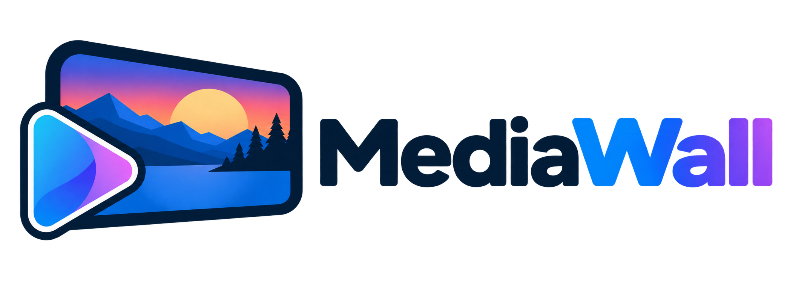

  <a href="https://ko-fi.com/yeahnoforsure_" target="_blank" rel="noopener noreferrer">
    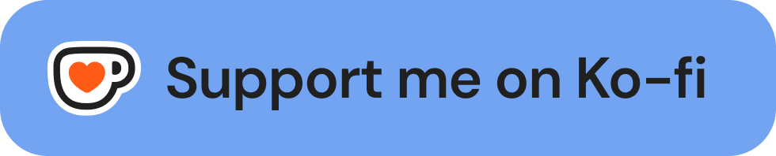
  </a>

  Also by me:
  <a href="https://github.com/nothing2obvi/pixelfin">Pixelfin</a> ·
  <a href="https://github.com/nothing2obvi/jellyfin-plugins/tree/main/Jellytag">JellyTag-Plus</a> ·
  <a href="https://github.com/nothing2obvi/jellyfin-plugins/tree/main/TaskGrid">TaskGrid</a>

# MediaWall

## TL;DR

MediaWall is a way to take advantage of an old iPad, a Raspberry Pi with a display, or any spare screen by turning it into a live window into your Jellyfin and Navidrome servers. It can show what you and your users are currently watching or listening to, cycle through artwork from your libraries as a screensaver, or display favorite media as wallpapers. With Multi-Scrobbler, it can also show Now Playing from external music sources such as Spotify. It also supports custom sounds, layouts, and fallback screens. Basically, it's a fun little project that's an overengineered way to view active sessions and make your media library visible instead of leaving all that artwork buried in storage.

## What's your use case for MediaWall?

Personally I use it as a “What’s now playing on the server?” passive display, with sounds so I know when a session starts. We might be doing something else, hear a pleasant chime, then go, “Ooh, someone started the new season of Ted Lasso.” I have about 25 regular users, so it’s just like a fun little thing that happens randomly. Sounds, of course, are optional.

It’s also been particularly useful when my wife and I host parties. One of us plays music via Bluetooth on our speakers, and the display shows us what’s playing, complete with backdrop artwork, album cover, and media info, whether I play music from Navidrome or my wife plays music from Spotify. When someone asks what’s playing, we just tell them to check the screen.

And when nothing’s playing at all, it falls back to Immich Kiosk, so our family photos are displayed. Immich Kiosk integration is also optional.

## Screenshots

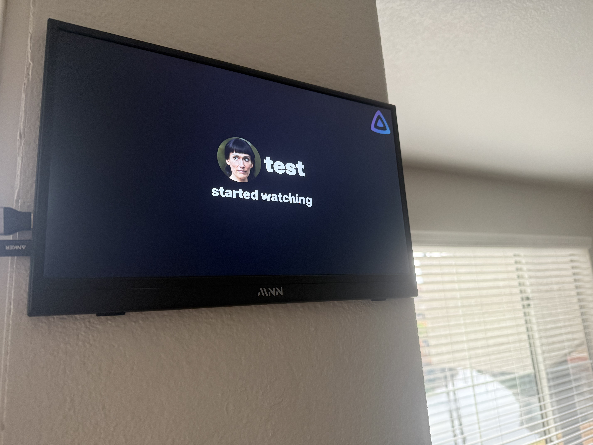

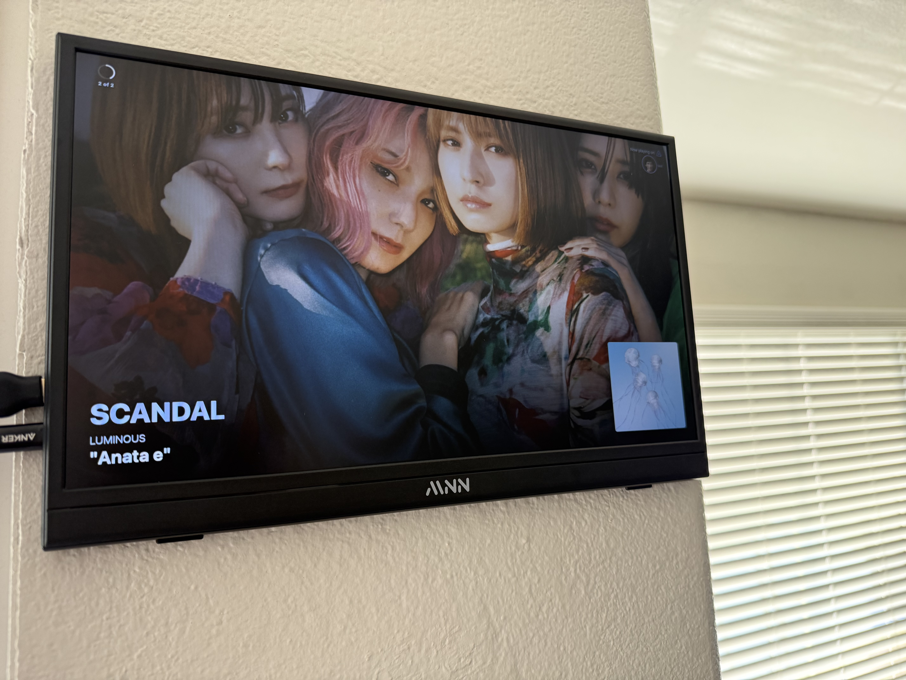

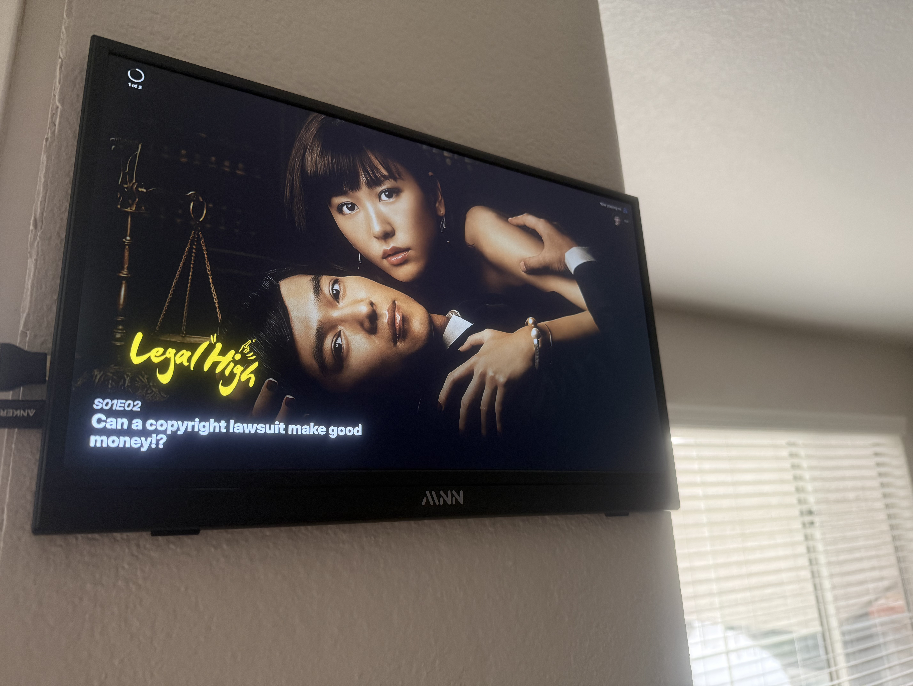

  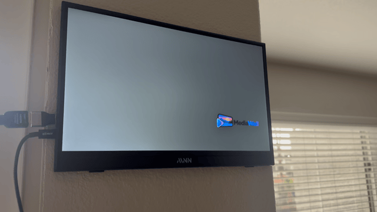

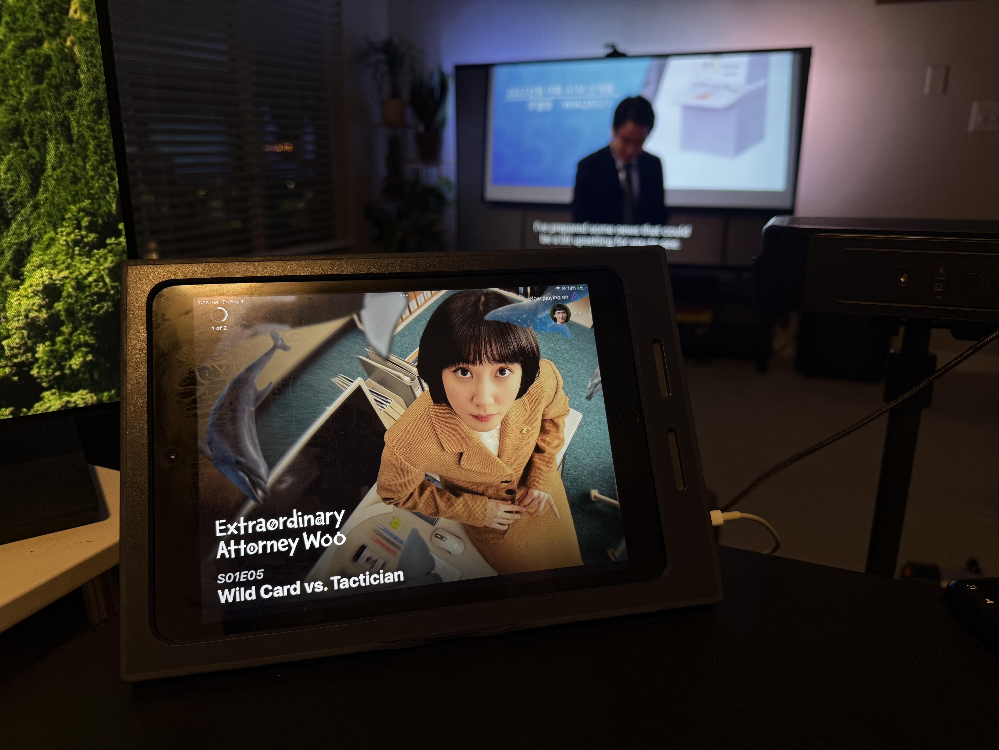

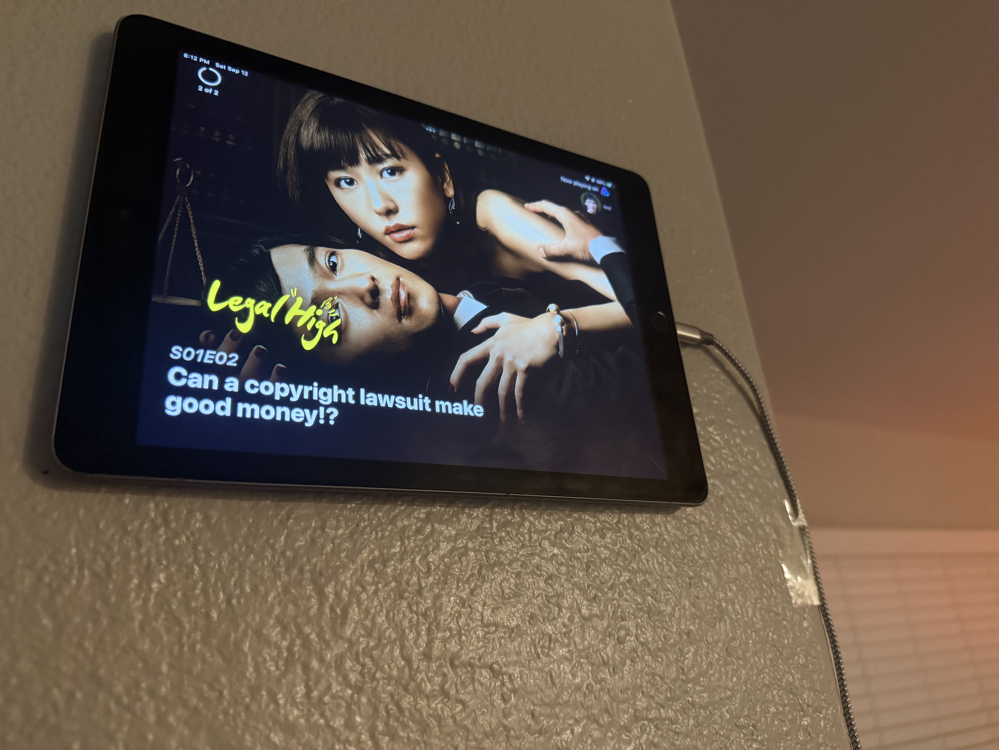

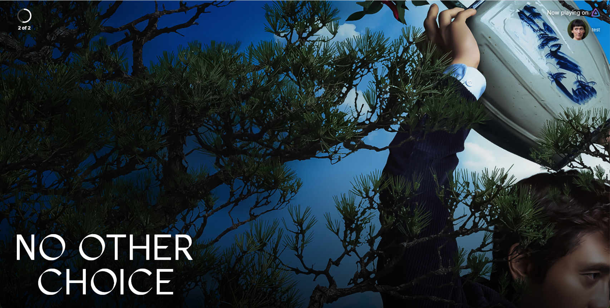

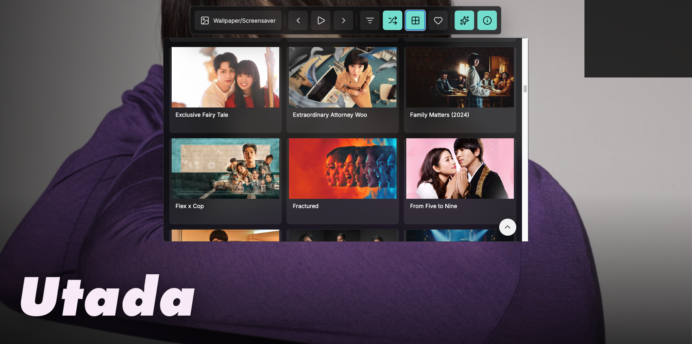

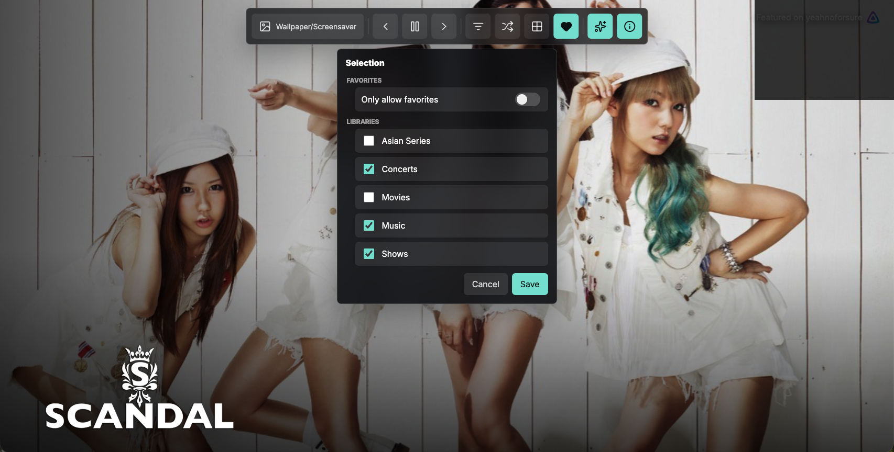

## ⚠️ Disclaimers

MediaWall is under active development. There may be breaking changes, which will be highlighted in every release.

Like [Pixelfin](https://github.com/nothing2obvi/pixelfin), this project is vibecoded with Codex. It's built with security in mind, but because it's a vibecoded self-hosted app, I can't promise it's hardened for hostile public exposure. Prioritize running it locally or behind access controls you trust.

## Intro

In line with my ongoing obsession with the images and artwork in Jellyfin, as seen through my other project, [Pixelfin](https://github.com/nothing2obvi/pixelfin), I wanted to combine my appreciation for the Jellyfin Android TV screensaver with the fact that I also like being able to glance over and see what people are currently watching or listening to on my Jellyfin and Navidrome servers.

Then I realized I had an old iPad laying around doing absolutely nothing. I wanted something that would work on that, or on something like a Raspberry Pi connected to a display. MediaWall was born.

MediaWall is a display app for Jellyfin, Navidrome and other external music sources via Multi-Scrobbler built around three main features, and it's meant to work well on an old iPad, a Raspberry Pi connected to a monitor, or really any device with a browser. Each display space also has a phone-friendly remote at the same route with `-remote` appended, so you can control the display without walking over to it.

The first, and most prominent, is **Now Playing**. MediaWall shows what's currently being watched or listened to across your Jellyfin and Navidrome servers or external music sources, along with artwork, user information, media details, and optional sound notifications when sessions start or end.

The sound system is customizable too. You can use one global sound, assign custom sounds to individual users, and control when sounds should or shouldn't play. This is especially useful with music libraries, where you probably don't want a notification every time the next song starts.

MediaWall can also react to configured Jellyfin collections by using collection-specific sounds and transition images when matching media starts playing.

The second feature is **Screensaver mode**. This is heavily inspired by the Jellyfin Android TV screensaver and cycles through artwork from your Jellyfin libraries, with additional options for controlling what appears and how it's displayed. The idea is to turn an otherwise unused screen into a constantly changing showcase for the artwork already sitting in your media collection. I know many of you have terabytes of media, but most of the time it's all just data sitting there. MediaWall gives you a way to passively browse your libraries and actually see more of it.

Third is **Wallpaper mode**. If MediaWall lands on something you particularly like, you can pause on that media item and use it as a static wallpaper. You can also choose favorites and have MediaWall cycle through those instead, essentially creating your own curated rotation of artwork.

While nothing is playing, MediaWall can cycle through your library artwork in Screensaver mode, show the bundled MediaWall screensaver or one with your own custom logo, or hand the display over to a configured **Immich Kiosk** setup. That way, even between playback sessions, the screen can keep working as a digital photo frame.

So depending on how you use it, MediaWall can be a live window into your Jellyfin and Navidrome servers, a Jellyfin-powered digital art display, or basically a very overengineered way to give an old iPad, Raspberry Pi, or spare screen something useful to do.

Is this necessary? No!

Is it a kind of fun excuse to use more electricity and tinker with something? Yes :)

## Use Cases

### See What Everyone Is Watching or Listening To

Put MediaWall on an iPad, tablet, TV, or Raspberry Pi display in a shared room and use it as a live window into your media server.

If someone is watching something on Jellyfin or listening to music through Navidrome, MediaWall can automatically show active sessions with backdrop artwork, logos, playback information, source icons, and, if you want, the name or avatar of the person using it.

So instead of asking, "What are we listening to?" or checking Jellyfin manually, you can just glance at the display.

### Turn It Into a Homelab Playback Dashboard

If you run Jellyfin for multiple people, MediaWall can also act as a simple visual dashboard for your server. Set it to watch all Jellyfin users, and the display will automatically show all active sessions.

It's an easy way to make activity on your server feel a little more visible and alive without opening an admin dashboard or staring at a list of sessions.

### Use It as an Artwork Display

MediaWall doesn't have to show playback activity at all.

You can put it on a desk, shelf, wall-mounted tablet, or Raspberry Pi-connected display and use it as a rotating screensaver for the artwork in your Jellyfin library.

If you don't want it pulling from everything, open the grid and favorite the artwork you actually want to see, or only allow specific libraries. MediaWall can then rotate through only those favorites or libraries, essentially turning your media collection into a curated digital art display.

And if one image looks especially good, just pause the slideshow and leave it there as a clean static wallpaper.

That's really the idea behind MediaWall: it can be a Now Playing display, a homelab dashboard, a screensaver, a wallpaper, or some combination of all of them depending on where you put it.

## What It Does

- Shows active playback sessions from Jellyfin, Navidrome, or both, including Jellyfin Live TV channels
- Shows active playback sessions from external music sources such as Spotify through Multi-Scrobbler.
- Supports multiple MediaWall users per space, including Jellyfin `All` users.
- Can show a configurable user-intro transition when a Now Playing session first appears.
- Falls back to a default MediaWall screen, shuffled artwork, or an optional per-space Immich Kiosk display when nothing is playing.
- Provides a full-screen Wallpaper/Screensaver mode with library browsing, favorites, shuffle, logos, media info, transitions, and subtle backdrop motion.
- Uses Jellyfin, Navidrome, and Spotify backdrops/logos where available.
- Can use Navidrome playback for music-focused setups, and Navidrome can use Jellyfin's images when both services are configured.
- Can use local artist backdrop and logo files for Navidrome-only artwork.
- Includes an image editor for logos and backdrops, with provider search, uploads, enlarged previews, ordering, and deletion across Jellyfin, local artwork, and the external artwork cache.

Jellyfin is recommended because MediaWall can use its rich backdrop, logo, user avatar, movie, series, and artist metadata. Navidrome isn't strictly required, and Jellyfin isn't strictly required for a music-only wall: Navidrome can drive Now Playing and local artist backdrop files can provide artwork. If both Jellyfin and Navidrome are configured, Navidrome playback can match against Jellyfin artist data so the Now Playing and Wallpaper/Screensaver views still benefit from Jellyfin's images.

## [Documentation](docs/README.md)

Upgrading from v0.3.1? Read the [configuration migration notes](docs/upgrading.md) before starting v0.4.0.

## License

Starting with v0.2, MediaWall is licensed under the [GNU Affero General Public License v3.0](LICENSE). MediaWall remains open source and may still be used commercially, but modified versions used over a network must make the corresponding source code available under the terms of the AGPLv3. Previously released MIT versions remain under the license that accompanied those releases.

## Contributors

Contributions welcome.
